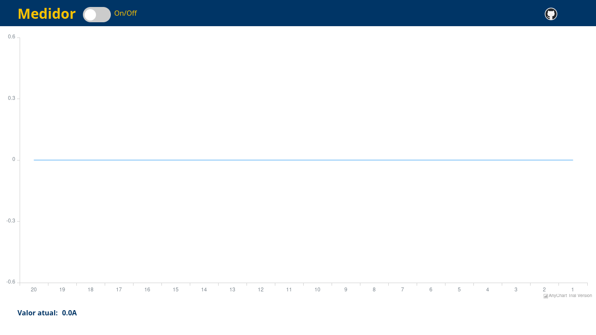

# Medidor de Eletricidade

Repositório criado para disponibilização do código e documentação do projeto de Medição de Eletricidade, criado para a matéria de Computação Física e Aplicações, ministrada pelo Professor Doutor Fábio Nakano na Universidade de São Paulo. Neste projeto estará tanto o código, como a motivação e o racional por trás de decisões.

## Materiais

1. ESP32 microcontrolador
2. Sensor de corrente Allegro ACS712-05
3. Resistores e resistor variável
4. Placa de prototipagem
5. Conectores jumper

## Conceito

A ideia central do projeto é obter a leituras do sensor de corrente e então fornencer uma interface de fácil utilização para que os dados coletados sejam demonstrados em tempo real.

## Montagem

1. Pino VCC do ACS712 é conectado ao VCC do ESP32
2. Pino GND do ACS712 é conectado a um dos pinos GND do ESP32
3. Pino OUT do ACS712 é conectado ao divisor de tensão (explicação a seguir) e então ao ESP32

### Divisor de tensão

O conversor analógico digital do ESP32 tem a capacidade de lidar com sinais de amplitude de 0V - 3,3V. Enquanto que o sinal de saída do ACS712 possui amplitude de 0V - 5V. Por essa razão, é necessaŕio que o sinal de saída do ACS712 seja fornecido ao ESP32 por meio de um divisor de tensão o qual pode ser construído utilizando-se de resitores fixos ou da forma representada a baixo, com um resistor fixo e um resistor variável.

A fórmula que relaciona a tensão de entrada e tenão de saída no divisor de tensão é a seguinte:

Vout = (R2 / R1 + R2) Vin

Na qual, Vout é a tensão esperada na saída do divisor, Vin é a tensão de entrada, R1 e R2 são os valores da resistividade dos resistores.

No contexto do projeto, é necessário que a tensão de saída seja de 3,3V, no máximo, enquanto que a maior tensão de saída do sensor, é em teoria, 5V. Dessa forma temos:

 Vout = 3,3V
 Vin = 5V
 R1 = 10KΩ (escolhido ao acaso)
 R2 = 5151Ω (determinado matematicamente)

Produzindo assim a redução necessária. Além disso, de acordo com a folha de especificações do sensor, é esperado que haja uma variação de 185mV/A em relação a corrente eletrica a qual será medida. Mas ao passar o sinal pelo divisor de tensão, tal valor torna-se 122mV/A. Ou seja, para cada 1A de variação na corrente medida, havera uma variação de 185mV no sinal de saída do sensor e uma variação de 122mV no sinal lido pelo ESP32 através do divisor de tensão.

É esperado, pela folha de especificações do ACS712, que a tensão de saída para o caso de a corrente medida ser 0A deve ser de 2500mV. Porém, foi determinado empiricamente que o valor medido pelo ESP32, sem utilizar o divisor de tensão era de 2260mV, o que pode ser causado por interferências no fornecimento de energia ao ESP32. Por isso, o valor esperado na saída do divisor de tensão é de 1492mV, e dessa forma o divisor teve sua calibração final fina feita ao mover o resistor variável levemente até que o valor lido pelo ESP32 fosse correspondente ao teoricamente esperado (por volta de 1490mV).

### Conversor analógico digital

O ESP32 conta com um conversor analógico digital com capacidade de medir sinais de amplitude 0-3,3V. A arquitetura do ESP32 é de 12 bits e por essa razão, pode representar números inteiros entre 0 e 4096. Assim, intenamente, um sinal recebido em um pino do ESP32 será representado, de acordo com a sua intensida, em uma escala de 0 a 4095. Com sinal de intensidade 0V sendo lidos como 0 e sinais de intensidade 3,3V sendo representados como 4095. Os valores intermediários são proporcionalmente representados na escala dessa forma. Por isso, para se obter o valor da intensidade do sinal recebido do sensor em volts é necessário multiplicar os valores brutos lidos pelo ESP32 por 0,805.

### Exemplo de montagem

## Software | Visão Geral

Foi definido que o ESP32 ficaria responsável por executar um programa Python capaz de realizar as medições do sensor de corrente. Para isso, foi necessário instalar o MicroPython no ESP32. Para o desenvolvimento do programa, foi escolhida a IDE Thonny, por sua simplicidade e facilidade de interface com o ESP32 (É necessário instalar na IDE o plug-in do ESP32 o que pode ser feito através da ferramente interna da IDE).

No ESP32 foi armazenado o código fonte do projeto MicroWevSrv, disponível em: https://github.com/jczic/MicroWebSrv.git
Esse servidor é capaz de realizar as funções necessárias para o projeto:

1. Prover arquivos HTML, CSS e Javascript
2. Enviar e receber requisições HTTP, transferindo dados JSON

Ao iniciar o programa, o ESP32 fica preparado para receber requisições de dados no endereço: 
http://ip_do_ESP32_na_rede/valor

A página web (medidor.html) ao ser acessada pelo usuário, inicialmente não realiza requisições. Ao acionar o botão on/off na página, a mesma inicia o envio de requisições HTTP para o endereço supramencionado do ESP32 e ao receber os dados da medição instantânea do sensor, os adiciona ao gráfico de linha central na página.

Mais abaixo é é detalhado os principais pontos e arquivos.

### Software - ./www/medidor.html

Contém página web contendo como principais elementos: botão on/off, que quando on realiza a medição de corrente através dos sensores. Gráfico com a medição de corrente produzido através da biblioteca anychart (ver mais em: https://www.anychart.com/). Link para o github do projeto (https://github.com/rodrigo-birocchi/ESP32-medidor-eletricidade).

### Software - ./www/script.js

Arquivo responsável pela inclusão do gráfico e sua atualização na interface. Inclui também chamada a API, que por sua vez retorna a medição. No método window.setInterval(), é possível configurar a frequência de medição em milissegundos.

### Software - ./ACS721/current_sensor.py

Escrito em python contém de fato a medição e gestão do sensor.

leitura(): realiza a leitura analógica, conforme o datasheet do sensor.

auto_zero(): encontra o zero do sensor, isto é, ausência de corrente.

valor(): retorna corrente em ampéres, conforme especificações acima.